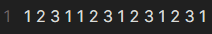
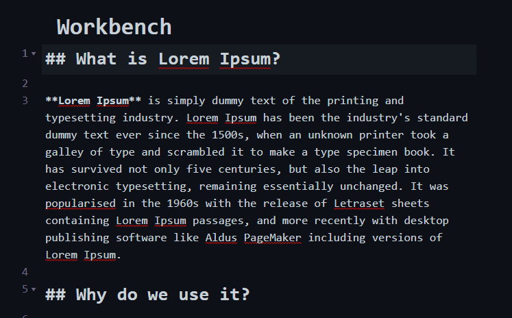

# Advanced Cursors

Advanced Cursors adds new commands to Obsidian which let you take more advantage of [multiple cursors](https://help.obsidian.md/How+to/Working+with+multiple+cursors).

## Commands

### Move to next instance of current selection

This command takes the text you currently have selected, and moves the cursor to the next instance of that same text.

If no next instance is found, it will loop back to the beginning of the note.

### Add next instance of current selection to selections

This command does mostly the same as the previous, except it keeps your previous cursors in place.
Similarly, if no next instance is found, it will loop back to the beginning of the note.

This does the same thing as `Ctrl + d` in VS Code.

### Open Regex match modal

This command allows even more fine-grained control of where you place the cursor.

When you open the modal, you will see a text input field, and submit button, and an option to toggle `Regex`.

Enter a search query into the input field, and Advanced Cursors will place a cursor at each place in the current document that matches the query.

Toggle `Regex?` for the query to be treated as a regex, or a string literal.

You can now also use [Saved Queries](https://github.com/SkepticMystic/advanced-cursors/blob/master/README.md#saved-queries) to quickly run queries.

## Saved Queries

In the settings tab of Advanced Cursors, you will see an interface allowing you to `Add New Query`. This allows you to set up a query (regex or literal) to quickly access from the [Match Modal](https://github.com/SkepticMystic/advanced-cursors/blob/master/README.md#open-regex-match-modal), or run as an Obsidian command from the command palette.

In the `Add New Query` modal, you have 4 options:

1. The `name` of the query,
2. The actual `query` itself,
3. Any [regex flags](https://developer.mozilla.org/en-US/docs/Web/JavaScript/Guide/Regular_Expressions#advanced_searching_with_flags) to apply to the query (if it is a regex),
   - The `g` flag is automatically added, but it won't break if you add it yourself.
4. A toggle to say if the `query` should be interpretted as a regex or literal string.

### Running Saved Queries

After adding a query, it will appear in a list of saved queries in settings:

In the Match Modal (Simply click the query to run it:

As well as in the command palette:

